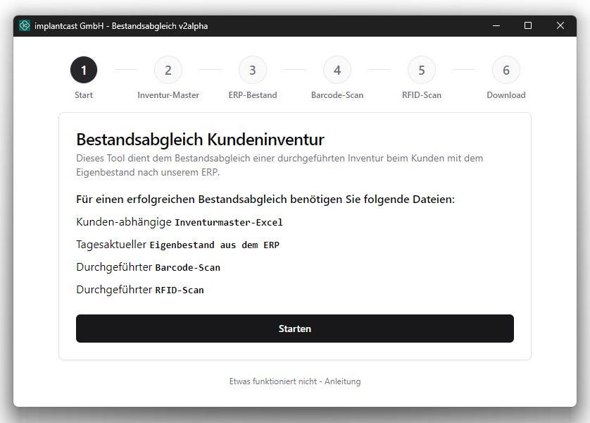
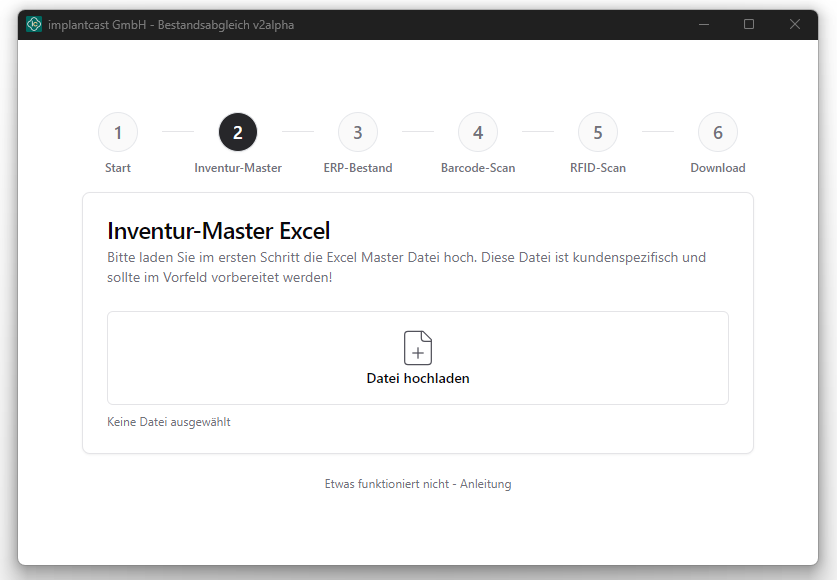
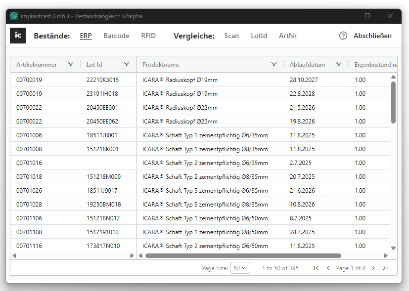

# RFID-Applikation – Bestandsabgleich v4.1.1

Um eine händische Inventur beim Kunden effizienter zu gestalten, wurde eine RFID-unterstützte Inventur eingeführt. Diese soll den händischen und zeitintensiven Prozess ablösen.
Dafür wurde eine Software für implantcast entwickelt, welche die erfassten Daten des RFID-Geräts mit unserem Bestand abgleicht.

Damit dieser Abgleich stattfinden kann, müssen vom durchführenden Mitarbeiter folgende Dateien vorbereitet / angefordert werden:

- Ein kundenspezifisches Master-Template, welches eine GTIN-Liste der Artikel von implantcast enthält (Excel)
- Ein tagesaktueller Abzug aus unserem ERP-System aller Produkte die laut unserer Daten beim Kunden liegen sollten (Excel)
- Das Programm für den Bestandsabgleich

## Dokumentation

Eine ausfühliche technische Dokumentation findet sich hier: [Dokumentation](./documentation/README.md)

## Tech Stack

Das Programm wurde mit folgenden Tools & Frameworks geschrieben:

**Frontend:** React, wouter, TailwindCSS, RadixUI, MaterialIcons, AG-Grid

**Applikation:** Tauri v2, Node

**Programmiersprachen:** TypeScript, (Rust möglich, aber nicht verwendet)

## Screenshots

|            Start Screen             |            Upload Screen             |             Editor View              |
| :---------------------------------: | :----------------------------------: | :----------------------------------: |
|  |  |  |
